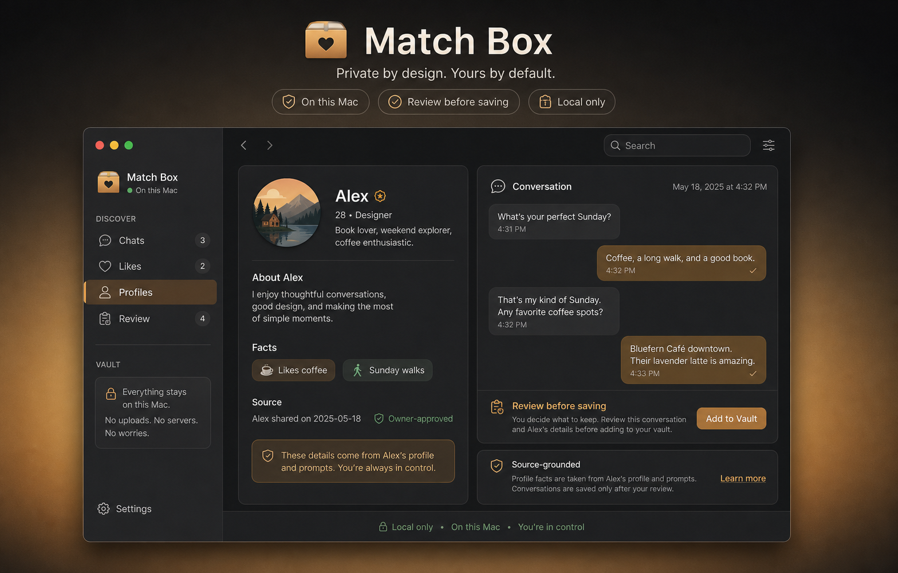

# Match Box

A private, local macOS companion for reviewing owner-selected visible dating
context. It includes a Swift CLI and a packaged Mac app. The app captures the
currently visible iPhone Mirroring window with ScreenCaptureKit, recognizes its
text locally with Vision, shows a review-before-save preview, and persists only
approved text in SwiftData. Screenshots are not retained.

It has no dating-service API, login, app automation, background monitoring,
swipe, like, match, contact, or send capability. Mirroir MCP is useful while
developing and validating the visible-screen adapters; it is not a shipped app
dependency.

Read the draft [privacy notes](docs/PRIVACY.md) and the local-only
[Product Hunt draft](docs/PRODUCT_HUNT_DRAFT.md) before preparing any public
material.



*Fictional demo content only. Match Box has no Bumble, Hinge, or other dating
service API integration.*

## OSS status

The source is MIT-licensed and ready for review and reproducible local
build/test. See the [owner test matrix](docs/OWNER_TEST_MATRIX.md), [security
policy](docs/SECURITY.md), and [contribution guide](CONTRIBUTING.md).

## Adapter status

**Bumble-tested:** visible Profile, Likes, Chats, and Thread adapters have
bounded local test evidence. **Hinge:** classified fixtures exist; live owner
acceptance remains pending. Match Box is independent and unaffiliated with
Bumble, Hinge, or any other dating service; their names are used only to
describe compatible visible-screen adapters.

## Run the Mac app

```sh
./script/build_and_run.sh
```

Open iPhone Mirroring, then choose **Capture iPhone Mirroring** in Match Box.
Grant macOS Screen Recording permission when prompted. Review the literal OCR
text and choose **Save approved context**. The optional on-device review uses
Apple Foundation Models only on already-saved text; it has no cloud fallback
and must label unknowns rather than expand abbreviations or invent facts.

## Try the fictional sample

```sh
swift run match-inbox inbox Samples/redacted-sample.json
swift run match-inbox read Samples/redacted-sample.json alex-thread
swift run match-inbox profile Samples/redacted-sample.json alex
swift run match-inbox suggest Samples/redacted-sample.json alex-thread
swift run match-inbox suggest Samples/redacted-sample.json alex-thread --local-model
swift run match-inbox import Samples/redacted-sample.json .match-inbox/history.json
swift run match-inbox inbox .match-inbox/history.json
```

`--local-model` reports whether Apple Foundation Models is available on this
Mac, then uses deterministic local drafts. The Mac app's **Review saved
context** action uses the available on-device model for a bounded review, with
the same deterministic fallback. It has no remote fallback and uses no API key.

## Import shape

The input must be a locally selected JSON document with `ownerID`, `profiles`,
and `threads`. Each message needs `direction` (`incoming` or `outgoing`) and
text; timestamps are optional. An optional `provenance` object can record the
owner-selected `sourceApp`, `sourceScreen`, and `capturedAt` without retaining
a screenshot. Keep real snapshots outside Git: `imports/`, `screenshots/`, and
`.match-inbox/` are ignored.

`import <snapshot> <history>` creates or merges a local history file. Exact
messages are deduplicated, while newly visible profile facts and messages are
retained. `inbox`, `read`, `profile`, and `suggest` can then use that history
file just as they use a one-off snapshot.

The CLI supports a generic redacted-import workflow for Bumble, Hinge,
WhatsApp, Messages, Signal, or another chat app. The native capture path is
currently tuned for the visible iPhone Mirroring window and has bounded Bumble
and Hinge screen-classification anchors; unrecognized screens are previewed but
cannot be saved.
Every draft prints the imported message or profile fact that grounded it. The
owner chooses whether to send any draft in the source app.

To review an approved Match Box SwiftData store instead of a JSON sample:

```sh
swift run match-inbox review-local \
  "$HOME/Library/Application Support/MatchBox/MatchBox.store" \
  <profile-id>
```

This command reads only the local store and never sends output to a provider.

## Development-only Mirroir bridge

Mirroir MCP is optional test infrastructure, not a shipped dependency. A local
MCP host can pass visible screen labels to the Swift CLI, which writes a
review-only preview for Match Box:

```sh
swift run match-inbox mirroir-preview \
  "$HOME/Library/Application Support/MatchBox/MirroirBridge/preview.json" \
  "Chats" "Your matches (2)" "Chats (Recent)"
```

Choose **Import Mirroir test preview** in Match Box. It follows the same
literal-OCR preview and explicit save approval as native capture. The bridge
does not send, tap, swipe, or write to a dating app; unrecognized screens stay
unsavable.

When the MCP host already knows the visible source screen, declare its bounded
kind instead of inferring it from conversation text:

```sh
swift run match-inbox mirroir-preview --kind bumbleThread \
  /path/to/preview.json "Delivered" "Aa"
```

Supported values are `bumbleChats`, `bumbleLikes`, `bumbleProfile`,
`bumbleThread`, `hingeChats`, `hingeLikes`, `hingeProfile`, and `hingeThread`.

For a visible conversation, a local MCP host can preserve the normalized
horizontal position it observed. Write only the visible, reviewable
observations to a local JSON file:

```json
[
  {"field":"visible_text","text":"Coffee this week?","confidence":0.98,"positionX":0.21},
  {"field":"visible_text","text":"Thursday works","confidence":0.97,"positionX":0.79}
]
```

Then create the same local preview with its declared kind:

```sh
swift run match-inbox mirroir-positioned-preview bumbleThread \
  /path/to/visible-observations.json \
  "$HOME/Library/Application Support/MatchBox/MirroirBridge/preview.json"
```

Positions must be between `0` and `1`. For thread captures, left-side visible
bubbles become incoming messages and right-side bubbles become outgoing
messages; delivery/read chrome is discarded. This does not reconstruct hidden
history and still requires explicit import approval in the app.
